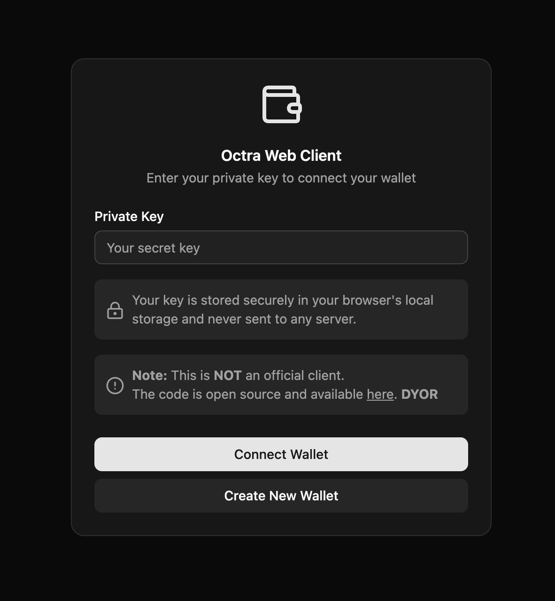
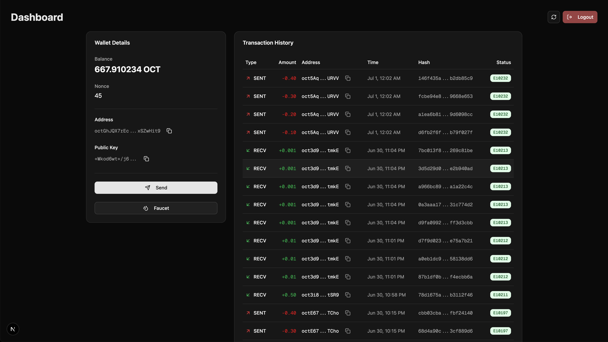

# octra web client (NOT official)

**NOTE**: This is **NOT** an official client.

This is a simple web client for [Octra](https://octra.org/), made for users who are having difficulty with the **OFFICIAL** [TUI (text-based user interface) client](https://github.com/octra-labs/octra_pre_client).




## Usage

Run your own development server:

```bash
npm install
npm run dev
```

Or, you can deploy it directly to Vercel:

[](https://vercel.com/new/clone?repository-url=https%3A%2F%2Fgithub.com%2Fdefi-failure%2Fnon-official-octra-web-client)


Or, use the deployed client [here](https://non-official-octra-web-client-main.vercel.app/).


## TODO
- [x] support multi send
- [x] support staging transaction history
- [ ] support transaction history pagination (api doesn’t seem to support this yet, will try later)
- [x] maybe support wallet generation?

